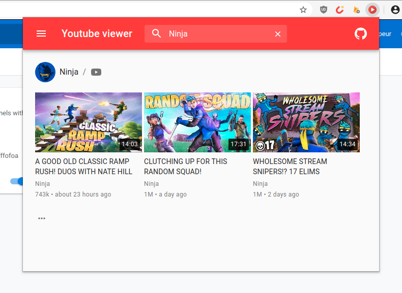

#  Youtube viewer

[](https://addons.mozilla.org/firefox/addon/yt-viewer/?src=external-github-shield-downloads)
[](https://addons.mozilla.org/firefox/addon/yt-viewer/?src=external-github-shield-downloads)
[](https://addons.mozilla.org/firefox/addon/yt-viewer/statistics/)
[](https://addons.mozilla.org/firefox/addon/yt-viewer/reviews/)
[](https://www.paypal.me/axeldev)

A web extension to keep tracking your favorite youtube channels with less hassle.



## Motivation

This is a fun made project with one simple goal: Discover & practice [React](https://reactjs.org/). Any help or feedback is welcome :pray:.

## Features

- Track multi channels all in one place
- Get notifications about new posted videos
- Auto play videos on click
- Export/import channels list
- (Soon) Open videos in [PiP](https://support.mozilla.org/en-US/kb/about-picture-picture-firefox) mode

## Installation

[](https://addons.mozilla.org/firefox/addon/yt-viewer/?src=external-github-download)
[](https://github.com/AXeL-dev/youtube-viewer/releases)

Or [try it as a web application](https://axel-dev.github.io/youtube-viewer/).

## Todo

- [x] Notifications for new posted videos (with auto-check every x minutes)
- [x] Improve caching (videos cache could be saved in the storage which may reduce API quota consumption)
- [x] Option to auto-play videos once opened
- [ ] Option to open videos directly in [Picture-in-Picture](https://w3c.github.io/picture-in-picture/) mode
- [ ] Translations

## Technical

### Stack

- [React](https://reactjs.org/): Core library
- [Material-UI](https://material-ui.com/): UI toolkit
- [lodash](https://lodash.com/): Utility library
- [react-beautiful-dnd](https://github.com/atlassian/react-beautiful-dnd): Drag and drop library
- [Gulp.js](https://gulpjs.com/): Workflow automation toolkit

### Scripts

In the project directory, you can run:

#### `npm start`

Runs the app in the development mode.<br />
Open [http://localhost:3000](http://localhost:3000) to view it in the browser.

The page will reload if you make edits.<br />
You will also see any lint errors in the console.

#### `npm test`

Launches the test runner in the interactive watch mode.<br />
See the section about [running tests](https://facebook.github.io/create-react-app/docs/running-tests) for more information.

#### `npm run build`

Builds the app for production to the `build` folder.<br />
It correctly bundles React in production mode and optimizes the build for the best performance.

The build is minified and the filenames include the hashes.<br />
Your app is ready to be deployed!

See the section about [deployment](https://facebook.github.io/create-react-app/docs/deployment) for more information.

#### `npm run eject`

**Note: this is a one-way operation. Once you `eject`, you can’t go back!**

If you aren’t satisfied with the build tool and configuration choices, you can `eject` at any time. This command will remove the single build dependency from your project.

Instead, it will copy all the configuration files and the transitive dependencies (Webpack, Babel, ESLint, etc) right into your project so you have full control over them. All of the commands except `eject` will still work, but they will point to the copied scripts so you can tweak them. At this point you’re on your own.

You don’t have to ever use `eject`. The curated feature set is suitable for small and middle deployments, and you shouldn’t feel obligated to use this feature. However we understand that this tool wouldn’t be useful if you couldn’t customize it when you are ready for it.

#### `npm run package`

**Note: the web-ext package is required. You can install it using `npm install -g web-ext`.**

Packages the app in a zip file.

## Setup your own Youtube API key

Create a `.env` file in the root directory of the project & put inside your API key like so:

```
REACT_APP_YOUTUBE_API_KEY=replace_this_with_your_api_key
```

Save, then start or build the app.

## Credits

Icon made by [Vectorgraphit](https://www.iconfinder.com/vectorgraphit) and is licensed under [Creative Commons Attribution 3.0 Unported License](https://creativecommons.org/licenses/by/3.0/).

## License

This project is licensed under the [MPL2](LICENSE) license.
